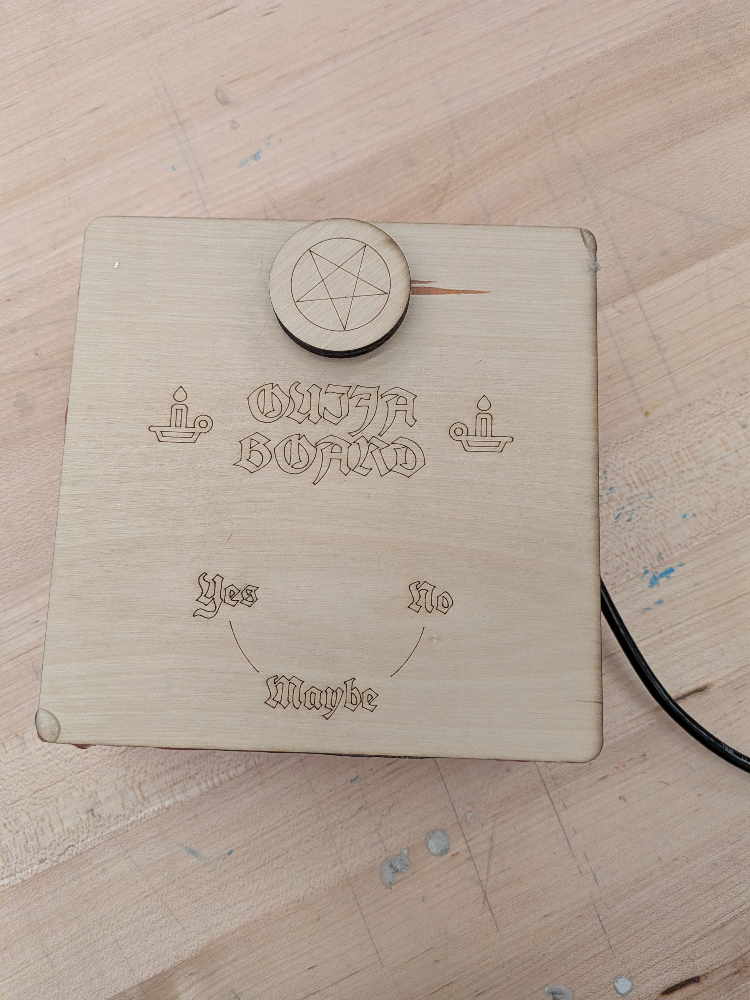
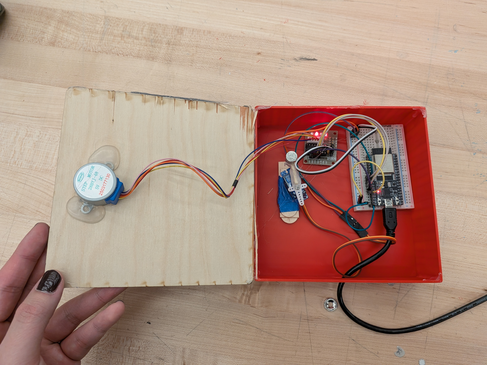
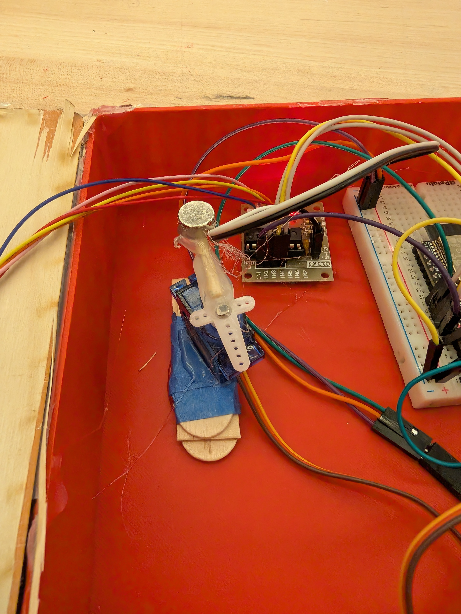
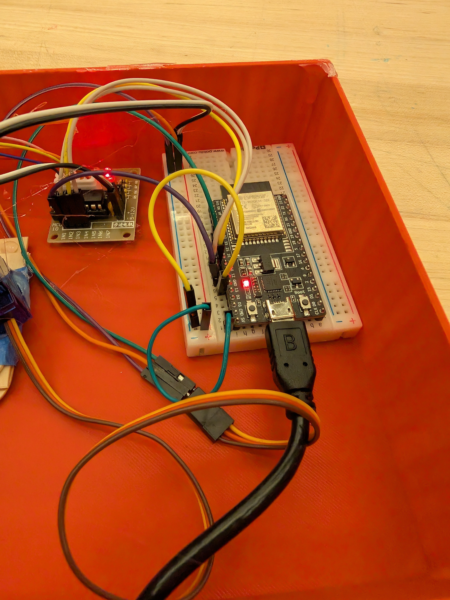

# Ouija GPT

One day, you find a mysterious box labeled "ouija board" sitting on your desk. After observing it for a while, you realize that it has a life of its own. A long-deceased spirit is haunting the board, and you will not rest until you can figure out who the ghost is. Luckily, the spirit is willing to answer yes/no questions by way of moving a planchette on the board... what will you ask it?

[**VIDEO DEMO**](./resources/demo.mov)

## Creative Motivations

My goal for this project was to make a somewhat functional version of a Ouija Board, leveraging the OpenAI API to give plausible answers to the user. From the start, I wanted there this effect to be invisible—the microphone recording audio input would be hidden out of sight; no electronics would be visible from the outside; and the planchette would move by itself, seemingly unattached to any mechanism.

As I developed the project, I realized I could give the "spirit" a personality through prompt engineering. While the original concept was cool, as you could ask it factual questions like "is the sky blue," I wanted to add a more mysterious element. Through asking many questions guided by pre-conceived notions of what a Ouija Board does, users learn that there is one specific spirit haunting the board. The user experience then turns into a fun game of "guess who" / "twenty questions," with the user trying to guess what spirit lurks inside the board. While I won't reveal the answer here, some questions you might ask:

> - _Are you alive?_
> - _Are you an evil spirit?_
> - _Did you go to Yale?_

## Hardware Implementation

A stepper motor drives a laser cut token with a pentagram inscribed on it. The stepper motor turns whenever a user is detected to be speaking. This directly gives the user an indication that the board is listening, and is the first indication of something "magical."

A servo motor drives the planchette via permanent magnets on either side of the laser cut board. It stops at one of three positions: "yes", "no", "maybe".

## Software Implementation

A Python program continuously collects audio samples from a microphone and sends them in real-time to the OpenAI Transcriptions API. (While the code was mostly done with AI, none of the code generation models knew how to use this API due to its recent release date, so I had to do this by hand.) The Transcriptions API provides NLP-based "turn detection," which informs the software when to turn the stepper-driven pentagram and when to give the user an answer.

After a full sentence transcription is received from the Transcriptions API, it is apped to the Completions API along with the prompt. `gpt-4o-mini` is instructed to return "yes", "maybe", "no", or "invalid" based on how the spirit would respond to the user's question. This sends a signal via serial to the ESP32, which moves the servo motor accordingly.

## Gallery

